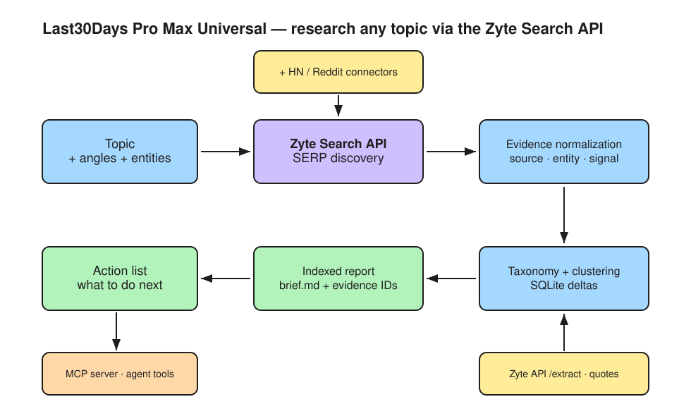

# Last30Days Pro Max Universal

> Topic-general web listening for the agentic web, powered by the Zyte Search API.

## One-line idea

Point it at **any** subject and get back a full indexed research brief — with
evidence IDs — of what the public web has been saying and shipping recently.

```text
fresh SERP discovery → evidence normalization → theme/entity taxonomy → indexed report → action list
```



> Diagram source: [`docs/last30days-pipeline.excalidraw`](docs/last30days-pipeline.excalidraw) (open and edit at [excalidraw.com](https://excalidraw.com)).

This is the general-purpose sibling of **Last30Days Pro Max**. The original is
hard-wired to a fixed competitor taxonomy (Apify, Firecrawl, Bright Data…) for
Zyte's market. This version strips that out: there's no built-in vendor list and
nothing scraping-specific in the pipeline. You bring the `--topic`; the Zyte
Search API brings the freshest results from Google.

## Why this exists

The pattern from [`mvanhorn/last30days-skill`](https://github.com/mvanhorn/last30days-skill)
is powerful — *recent public signal → normalized evidence → ranked clusters →
grounded brief*. The original spreads across a dozen credentialed social APIs.
This version makes **one reliable web-data layer — the Zyte Search API — the
turbo-boost**: a single key turns "research the last 30 days of X" into a
repeatable, evidence-backed pipeline for literally any X.

## What you get

For any topic, one command produces an inspectable artifact pack:

| File | What's in it |
|------|--------------|
| `brief.md` | The indexed research brief — 12 sections, every claim tied to an evidence ID |
| `evidence.jsonl` / `evidence.csv` | Every normalized result: source type, entity, signal type, themes, confidence |
| `queries_used.json` | The exact SERP query pack that ran |
| `raw_serp_results.json` | Raw Zyte Search API payloads |
| `run_metadata.json` | Run parameters and counts |
| `extracted_pages.jsonl` | Page-level quotes (with `--extract`) |

## Quickstart

No credentials needed for the demo — `--mock` produces deterministic sample data.

```bash
# Deterministic demo (no Zyte key required)
python3 -m last30days_universal.cli --topic "electric vehicle batteries" \
  --entities "Tesla,CATL,QuantumScape" \
  --angles "solid state,recycling" \
  --hn --reddit --extract --mock

# Live run against the Zyte Search API
export ZYTE_API_KEY="your-key"
python3 -m last30days_universal.cli --topic "AI coding agents" \
  --entities "Cursor,Copilot,Claude Code" \
  --angles "pricing,benchmarks" --hn
```

Output lands in `outputs/<date>-<topic-slug>/`.

## The same engine, any topic

Because nothing is scraping-specific, the exact same command shape works for:

- `--topic "GLP-1 weight loss drugs" --entities "Ozempic,Wegovy,Zepbound"`
- `--topic "passkeys adoption" --angles "enterprise,browser support"`
- `--topic "indie game economics" --entities "Steam,itch.io" --reddit`
- `--topic "carbon capture startups" --angles "direct air capture,funding"`

## CLI flags

| Flag | Purpose |
|------|---------|
| `--topic` (required) | The subject to research |
| `--entities` | Comma-separated named things to track (products, people, orgs) |
| `--angles` | Comma-separated sub-topics/facets to drill into |
| `--sites` | Comma-separated domains to pin with `site:` filters |
| `--year` | Recency year hint added to the query pack |
| `--days` | Window label (default 30) |
| `--hn` / `--reddit` | Add direct Hacker News / Reddit community signal |
| `--extract` | Fetch top URLs for page-level quotes (extra Zyte cost live) |
| `--mock` | Deterministic sample data, no credentials |
| `--query-limit` | Cap queries actually run (cheap spikes) |
| `--no-store` | Disable SQLite run history + deltas |

## How it works

1. **Query pack** (`query_pack.py`) — expands `--topic` with recency modifiers
   (`latest`, `release`, `roadmap`…) and intent modifiers (`guide`, `review`,
   `alternatives`…), plus any `--angles`, `--entities`, and `--sites`.
2. **SERP discovery** (`zyte_search.py`) — each query hits the Zyte Search API;
   `--mock` synthesizes deterministic results *from the query itself*.
3. **Community connectors** (`connectors.py`) — optional Hacker News (Algolia)
   and Reddit (via Zyte `site:reddit.com`) for practitioner signal.
4. **Normalization** (`normalize.py`, `entities.py`) — every result becomes a
   classified evidence item: source type, tracked entity, signal type, theme
   tags, confidence, why-it-matters, recommended action.
5. **Extraction** (`extract.py`) — optionally fetch top URLs for richer quotes.
6. **Persistence** (`store.py`) — SQLite stores each run so the next one diffs
   *new / recurring / fading / rank-changed*.
7. **Report** (`report.py`) — renders the 12-section indexed brief.

## Use it as an agent tool (MCP)

A stdlib-only MCP server exposes the pipeline as five tools
(`build_query_pack`, `search_serp`, `normalize_evidence`, `generate_report`,
`run_report`):

```bash
python3 -m last30days_universal.mcp_server
```

## Development

- stdlib-only, no dependencies
- deterministic `--mock` mode is first-class so the demo always works
- tests: `python3 -m unittest discover -s tests -v`
